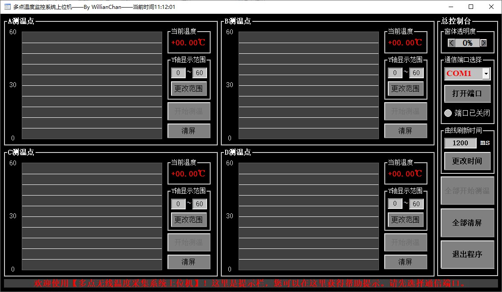

# 多点温度监控系统上位机

## 上位机介绍

- 多点温度监控系统上位机是我在 N 年前闲着 DT 的时候做的，基于 Visual Basic 6.0 开发，是的，相当古老的一门语言。

- 上位机界面如下

## 使用注意事项

  - 使用该软件之前，需要在自己的电脑上注册 MSCOMM32.OCX 文件，注册方法可自行查找。
  - 在 `Application` 文件夹中双击 `多点温度监控系统上位机.exe` 即可运行。
  - 下位机给上位机传的数据帧格式为 `±000.00C ±000.00C ±000.00C ±000.00C`，如 `+023.45C +018.32C -004.06C +020.61C`，表示 A 节点温度为 +023.45℃、B 节点温度为 +018.32C、C 节点温度为 -004.06C、D 节点温度为 +020.61C。
  - 该上位机最大支持四点的温度显示，如果用不到四点这么多，可以让其余空节点数据传 `±000.00C` 即可。举个栗子，若只需要检测两点的温度数据，下位机给上位机传的数据帧为 `+023.45C +018.32C +000.00C +000.00C` 即可。
  - 串口波特率为：9600bsp。

## 维护人信息

- [WillianChan](https://github.com/willianchanlovegithub) 
